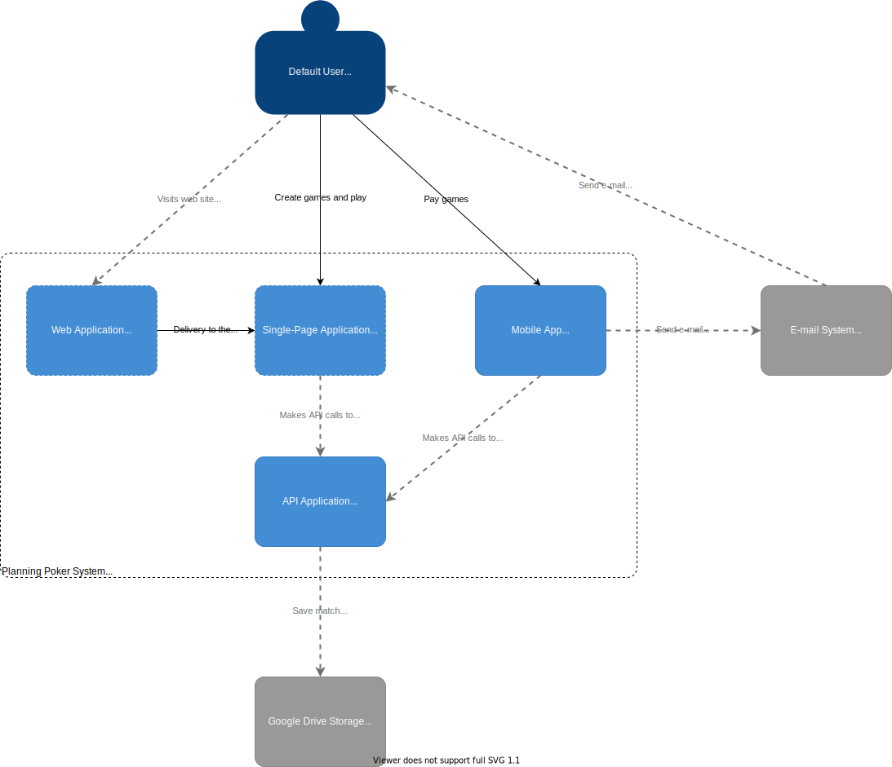
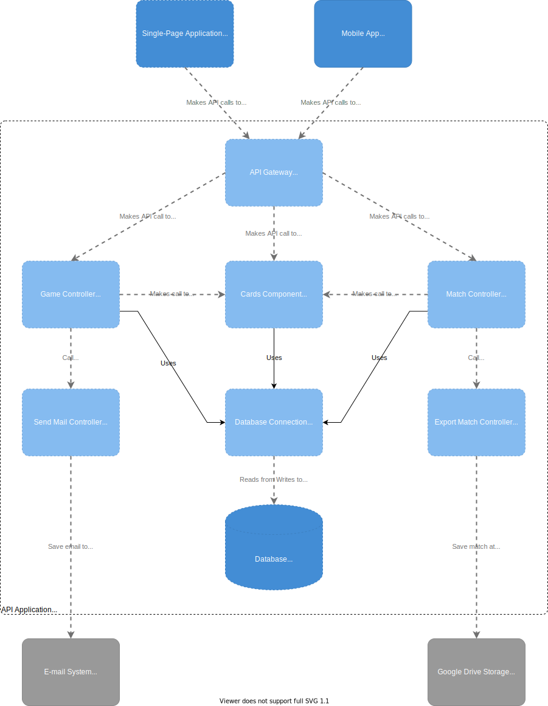
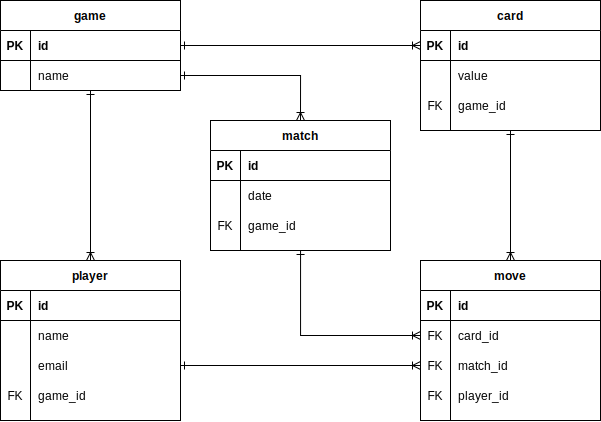

# Architecture

By definition Is adopted the [C4 Model](https://c4model.com/) to describe this solution architecture. It's simple and give to readers a fast way to understand how it's divided and implemented.

## Context Diagram

This diagram shows a big picture that tell a story of how the system makes interation with their users and others systems. Definitively this is focused on people (actors, roles, personas, etc) and software systems rather than technologies.

<!-- [filename](_media/drawio/context.drawio ':include :type=code') -->

This system has no different kind of user, limited to 1 (one) that have all functionalities, and 2 (two) active integrations, one with Google Workspace to save game information, and another with  SMTP server to send email to other users that that are invited to play the planning poker game.

## Containers Diagram

## Components Diagram

## Code Diagram

I know that this is not recomended by the C4 Model creators, but I wanna do it by sport :-). So lets read it!

### Database

#### Diagrama ER

#### Connector Library

### Game Controller

### Cards Controller

### Match Contoller

### Export Match Controller

### Send e-mail Controller

### API Gateway